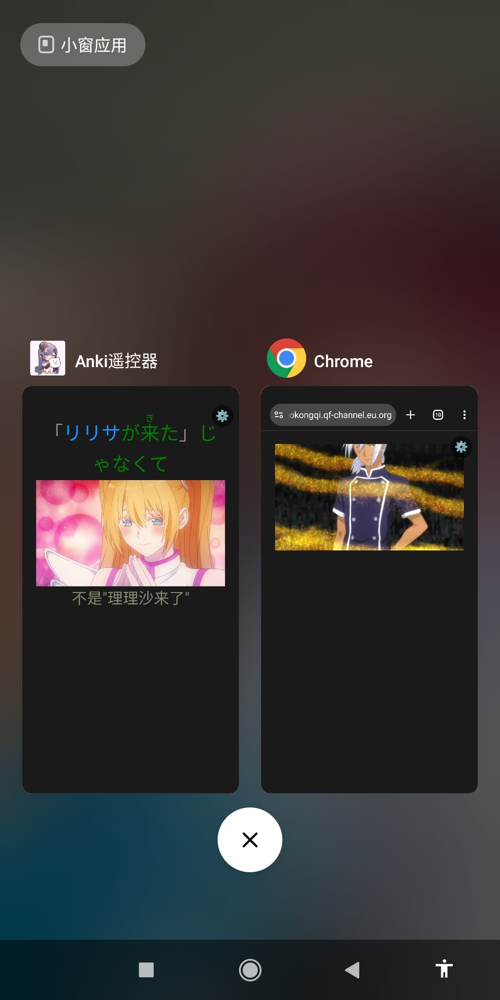
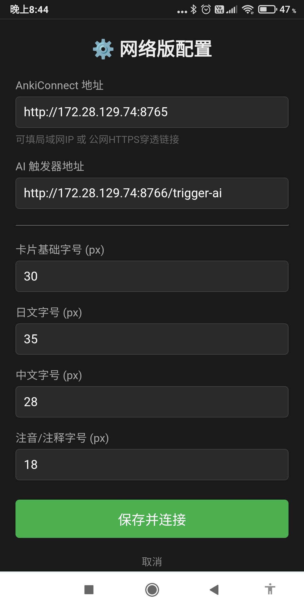

# Anki 遥控器 (Anki Remote)

Anki 遥控器是一个专为移动端设计的轻量级、沉浸式网页界面。它通过与桌面端 AnkiConnect 深度集成，让你能够躺在床上或在远离电脑时，仅通过手机浏览器即可舒适地完成 Anki 抽认卡的复习与学习。

## ✨ 核心特性

- **全屏沉浸式无按钮设计 (隐形九宫格)**：彻底摒弃传统拥挤的按钮布局，将整个手机屏幕划分为 3x3 的九宫格热区，点击屏幕对应区域即可触发相应操作。
- **500ms 硬件级防连点**：自带 500 毫秒节流机制，完美避免因手指双击、滑动误触或网络卡顿造成的重复提交和错误翻面。
- **媒体原生渲染**：深度解析并代理加载 Anki 卡片中的图像、音频与视频资源。即使脱离桌面端，移动端也能无缝播音、播放媒体。
- **智能防冲突机制**：
  - 滑动、点击卡片内链接/播放器时，自动放行原生操作，不会误判为九宫格触控。
  - **屏蔽卡内编辑插件**：强行剥离第三方“快捷编辑（Edit Field During Review）”等插件的 `contenteditable` 属性，并在底层拦截点击事件，彻底杜绝手机端误触发输入法弹窗。
- **AI 增强接口**：内置请求代理，无缝衔接外部 AI 工具（默认端口 8766），一键生成卡片注释并在前端实时刷新渲染。
- **自动响度均衡 (ReplayGain)**：内置 Web Audio API 混音引擎，自动解析 Opus/Ogg 等格式底层的 ReplayGain 标签数据，精准匹配桌面端 Target LUFS（默认 -25），确保所有音频回放音量始终如一。
- **可视化配置与 PWA 全屏**：提供 `index.html` 通用网络版入口，支持手机端可视化填写 IP、调整字体并永久记忆。完美支持添加到主屏幕化身为“免安装的全屏 App”。

## 🕹️ 交互指南 (触控与键盘)

### 📱 触控九宫格映射
本程序采用类似电脑全尺寸键盘右侧的**数字小键盘 (Numpad)** 布局进行交互映射。屏幕被均分为九个隐形区块：

| 屏幕区域 | 左侧 | 中间 | 右侧 |
| :---: | :---: | :---: | :---: |
| **顶部 (7, 8, 9)** | 暂不操作 | 暂不操作 | 暂不操作 |
| **中部 (4, 5, 6)** | **重来 (1)** | **AI 生成** | **重来 (1)** |
| **底部 (1, 2, 3)** | **良好 (3)** | **重播音频** | **良好 (3)** |

*操作小贴士：在未显示答案的“问题”界面，点击 `1`、`3`、`4`、`6` 任一区域都会自动执行**显示答案 (翻面)**。*

### ⌨️ 实体键盘快捷键
如果你的设备连接了蓝牙键盘，或者在电脑端进行测试，你可以使用以下快捷键（全局已配置 500ms 防连按）：
- **显示答案 (翻面)**：正面状态下，按 `1`、`3`、`6`、`空格 (Space)` 或 `回车 (Enter)`
- **重来 (Again)**：答案面状态下，按 `1` 或 `6`
- **良好 (Good)**：答案面状态下，按 `3`、`空格 (Space)` 或 `回车 (Enter)`
- **重播音频**：按 `R` 或 `4`

## 🚀 部署与使用

### 1. 桌面端前置要求
- 已安装 **Anki** 桌面版。
- 已安装 **AnkiConnect** 插件（插件代码：`2055492159`）。
- 在 Anki 顶部菜单栏点击 `工具 -> 附加组件`，选中 `AnkiConnect` 并点击 `配置`。将里面原有的代码全部删除，替换为以下配置（主要作用是允许局域网设备访问以及允许跨域）：
   ```json
   {
       "api": {
           "eval": true
       },
       "apiKey": null,
       "apiLogPath": null,
       "ignoreOriginList": [],
       "webBindAddress": "0.0.0.0",
       "webBindPort": 8765,
       "webCorsOriginList": [
           "*"
       ]
   }
   ```
   **注意：配置完成后需要重启 Anki 才能生效。**

### 2. 手机端配置 (可视化设置)
本项目提供了两种使用方式，推荐使用全新的**网络通用版**：

**方式一：使用可视化通用版 (推荐)**
👉 **免部署公益服务直接可用：[https://anki-yaokongqi.qf-channel.eu.org](https://anki-yaokongqi.qf-channel.eu.org)**

*（如果你希望自己本地运行/部署，请按以下步骤操作：）*
1. 在电脑上开启一个简易 HTTP 服务（例如 `python -m http.server 9999`）或者将 `index.html` 及相关文件部署到你的个人域名。
2. 手机浏览器访问 `http://你的电脑IP:9999/index.html`（或你的公网网址）。
3. 首次进入会弹出**可视化配置面板**。直接在输入框中填写你的 AnkiConnect 局域网 IP（如 `192.168.1.100:8765`，代码会自动补全 `http://`），并可随意调整适合你屏幕的各项字体大小以及**目标响度 (Target LUFS)**。
4. 点击保存，配置将自动永久保存在手机中。
5. **PWA 全屏体验**：在浏览器菜单点击“添加到主屏幕”，即可获得没有任何浏览器外壳的沉浸式全屏 App 体验！

**方式二：代码硬编码版 (老方式)**
如果你只需要一个极简单文件并完全脱机使用，可以用记事本打开 `anki遥控器.html`：
1. **配置局域网 IP 地址** (必填)：找到 `const ANKI_URL = 'http://127.0.0.1:8765';`，将其修改为你的实际 IP 地址。
2. **自定义手机端字体大小** (可选)：
   为了适应不同手机屏幕，我们在文件开头提取了 CSS 变量。如果你觉得字太小或太大，可以直接修改这些数字。
   *(注：目前的默认大小是基于作者使用的 **小米 Max 3** 感到舒适的尺寸，其屏幕参数为：6.9 英寸 / 2160x1080 分辨率 / 350 ppi。如果你的手机屏幕比例或大小不同，请自行上下调整。)*
   ```css
   :root {
       /* 📱 手机端专属字体大小调整 (仅在此修改即可生效) */
       --font-size-card: 30px;       /* 基础卡片字体大小 */
       --font-size-jp-text: 35px;    /* 日文字体大小 */
       --font-size-zhushi: 18px;     /* 注释字体大小 */
       --font-size-expression: 28px; /* 中文字体大小 */
   }
   ```
3. **自定义目标响度** (可选)：文件中有一个常量 `const TARGET_LUFS = -25;`，若你有在桌面端使用不同的 Target LUFS 习惯，可修改此数值。
4. 保存后直接将 HTML 文件发送到手机用浏览器打开即可。

### 3. 开始学习
保持电脑端 Anki 处于打开状态，手机端配置好 IP 并保存后即可瞬间同步获取当前正在学习的卡片。随时可以点击屏幕右上角的 `⚙️` 按钮修改配置。

## 🌍 外网远程访问 (进阶)

如果你希望在外出时（脱离家中局域网环境）也能使用手机遥控复习，可以通过以下方式实现：

### 方案一：使用 Tailscale 组建虚拟局域网 (推荐，安全)
通过 [Tailscale](https://tailscale.com/)、ZeroTier 等虚拟局域网工具，你可以将电脑和手机置于同一个安全的私密网络中。
1. 在电脑和手机上均安装并登录同一 Tailscale 账号。
2. 复制电脑在 Tailscale 中的虚拟 IP（例如 `100.x.y.z`）。
3. 将 `anki遥控器.html` 中的 `ANKI_URL` 修改为该虚拟 IP（例如 `http://100.x.y.z:8765`）。
4. 手机在开启 Tailscale 连接的状态下，打开 HTML 页面即可正常访问。

### 方案二：内网穿透 / 公网直接暴露
如果你使用 FRP、Ngrok、Cloudflare Tunnels 等内网穿透工具，或者路由器直通，可以将电脑本机的 `8765` 端口暴露到公网。此时只需将 `ANKI_URL` 配置为你穿透后的公网域名和对应端口即可。

> [!WARNING]
> **极其重要的安全风险警告**
> 
> AnkiConnect 接口本身**没有任何身份验证机制（没有密码保护）**。
> - 如果你采用**公网穿透**（方案二）直接暴露端口，意味着互联网上的**任何人**只要扫描到你的 IP 和端口，都可以**无限制地读取、修改甚至清空**你辛辛苦苦积累的所有 Anki 牌组和学习数据！
> - **强烈建议**：仅使用 Tailscale、ZeroTier 等经过端到端加密且自带身份验证的虚拟局域网工具（方案一）。
> - **如果必须暴露在公网**：请务必在你的穿透工具或前置反向代理（如 Nginx、Caddy）中配置严格的 HTTP Basic Auth (账号密码验证) 机制，并确保 AnkiConnect 仅监听在 `127.0.0.1`。绝对不要把未加保护的 AnkiConnect 裸奔在公网。

---

## 📱 运行截图

<div align="center">
  <table style="max-width: 600px; width: 100%; margin: 0 auto;">
    <tr>
      <td style="width: 50%; padding: 5px;"></td>
      <td style="width: 50%; padding: 5px;"></td>
    </tr>
    <tr>
      <td style="width: 50%; padding: 5px;"></td>
      <td style="width: 50%; padding: 5px;"></td>
    </tr>
  </table>
</div>
